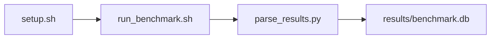

# PyTorch Tensor Op Correctness Suite Benchmark

[](LICENSE)
[](.github/workflows/ci.yml)

Target: Ubuntu 26.04 · NVIDIA · see Hardware Requirements. This is a host benchmark, not a laptop `pip install` project.

## Quick Start

```bash
git clone https://github.com/garys-gpu-benchmarks/405-gpu-bench-nvidia-pytorch-tensor-correctness-ubu2604.git
cd 405-gpu-bench-nvidia-pytorch-tensor-correctness-ubu2604
sudo bash setup.sh --assume-yes
bash run_benchmark.sh --profile smoke --validate
```
Results are written to `results/benchmark.db` and `results/summary.json`.

This workload is executed on the validation host after the repository is copied there. `setup.sh` and `run_benchmark.sh` do not open an outbound SSH session.

Prerequisites: Ubuntu 26.04; NVIDIA; Python 3.14.4; root or sudo for `setup.sh`. Framework: Bash, SQLite, Python, PyYAML, CUDA Runtime, PyTorch-CUDA, cuBLAS (GEMM), cuDNN (conv2d). This is a host benchmark, not a laptop `pip install` project.



## 1. Overview

Dispatches scripts/collect_tensor_ops.py to compare GPU matmul/conv2d against a CPU FP64 reference. device_id: torch CUDA device. op_name: yaml matmul,conv2d. dtype: yaml tokens f16_r, bf16_r, f32_r (smoke f16_r; baseline/extended f16_r,bf16_r,f32_r). Sweep dimensions: device_id, op_name, dtype, shape, rtol, atol, tolerance_rel, num_iterations.

## 2. What It Validates

- Validates PyTorch CUDA matmul/conv2d against CPU FP64 within rtol/atol across yaml op/dtype/shape cases
- #1: Max absolute error across correctness cases (max_abs_error); is present and physically sensible.
- #2: Maximum relative L2 error (max_rel_error); is present and physically sensible.
- #3: Tolerance-compliant case percentage (tolerance_compliance); is present and physically sensible.
- #4: Test case coverage count (coverage_count); is present and physically sensible.
- #5: Test case failure count (failure_count) is present and physically sensible.

## 3. Metrics Captured

- **#1: Max absolute error across correctness cases** — stored as `max_abs_error`.
- **#2: Maximum relative L2 error** — stored as `max_rel_error`.
- **#3: Tolerance-compliant case percentage** — stored as `tolerance_compliance`.
- **#4: Test case coverage count** — stored as `coverage_count`.
- **#5: Test case failure count** — stored as `failure_count`.

## 4. Hardware Requirements

### Supported environment

- OS: Ubuntu 26.04
- GPU vendor: NVIDIA
- Framework family: Bash, SQLite, Python, PyYAML, CUDA Runtime, PyTorch-CUDA, cuBLAS (GEMM), cuDNN (conv2d)
- Python: Python 3.14.4

### Reference validation environment

The tables below describe the machine used to generate the reference results. They are not a requirement that every user buy that exact cloud instance.

### System

Dispatches scripts/collect_tensor_ops.py to compare GPU matmul/conv2d against a CPU FP64 reference. device_id: torch CUDA device. op_name: yaml matmul,conv2d.

### GPU

Ubuntu 26.04 / NVIDIA / Bash, SQLite, Python, PyYAML, CUDA Runtime, PyTorch-CUDA, cuBLAS (GEMM), cuDNN (conv2d)

## 5. Software Requirements

| Component | Version |
|---|---|
| OS | Ubuntu 26.04 |
| Kernel | kernel 7.0.0 |
| Python | Python 3.14.4 |
| ROCm | CUDA 13.3 |
| rocBLAS | cuBLAS (bundled with CUDA 13.3) |

Dispatches scripts/collect_tensor_ops.py to compare GPU matmul/conv2d against a CPU FP64 reference. device_id: torch CUDA device. op_name: yaml matmul,conv2d.

## 6. Installation

```bash
Run local PyTorch CUDA matmul/conv2d correctness checks versus a CPU FP64 reference. Does not run pytest or the official PyTorch Operator Correctness test_ops.py suite
```

## 7. Running the Benchmark

```bash
Run local PyTorch CUDA matmul/conv2d correctness checks versus a CPU FP64 reference. Does not run pytest or the official PyTorch Operator Correctness test_ops.py suite
```

**Validating results separately:**

```bash
export BENCHMARK_PYTHON=/usr/bin/python3.13  # optional
python3 -m venv .venv
source ".venv/bin/activate"
".venv/bin/python" scripts/validate_results.py
```

## 8. Output

### `results/benchmark.db` (SQLite)

CSV from collect_tensor_ops.py with one row per op/dtype/shape case

check,command,rc,status,pass_rate_percent,max_abs_error,max_rel_error,tolerance_compliance,coverage_count,failure_count
matmul,matmul,0,ok,100,1e-3,1e-4,100,1,0

```bash
Run local PyTorch CUDA matmul/conv2d correctness checks versus a CPU FP64 reference. Does not run pytest or the official PyTorch Operator Correctness test_ops.py suite
```

### `results/summary.json`

Consolidated metrics from the most recent run — suitable for CI artifact upload or dashboard ingestion.

### `results/raw/<timestamp>.txt`

CSV from collect_tensor_ops.py with one row per op/dtype/shape case

check,command,rc,status,pass_rate_percent,max_abs_error,max_rel_error,tolerance_compliance,coverage_count,failure_count
matmul,matmul,0,ok,100,1e-3,1e-4,100,1,0

## 9. Baselines / Thresholds

Expected ranges and gates live in `config/benchmark_config.yaml` under `baselines:` or `thresholds:`. To update them, edit that file — never edit validation code directly.

## 10. Troubleshooting

**`setup.sh` missing collector**
Create cannot finish without `scripts/collect_workload.py`.

**`self_check` overlay rewritten**
Do not overwrite files listed in `results/overlay_lock.json`.

**Remote SSH drop during setup**
Reconnect and resume `bash setup.sh --assume-yes`. Do not wipe `.venv` or `.cache`.

## 11. NVIDIA H100 Coding Differences

Native NVIDIA CUDA workload. Execute on the stated Ubuntu release with the host NVIDIA driver and CUDA userspace. ROCm porting notes do not apply.

## Repository layout

```text
.
├── setup.sh
├── run_benchmark.sh
├── benchmark_specification.json
├── config/
├── scripts/
├── src/
├── tests/
├── docs/
├── results/
└── LICENSE
```
